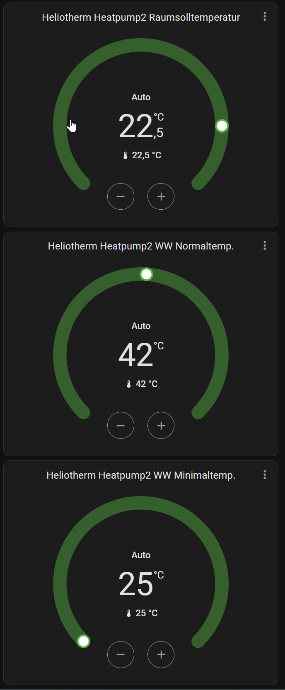

# HaHeliotherm_2 - Component

--

> [!CAUTION]
> This is a work in progress project.
>
> This is an unofficial implementation and not supported by Heliotherm. It might stop working at any point in time.
> You are using this module (and it's prerequisites/dependencies) at your own risk. Not me neither any of contributors to this or any prerequired/dependency project are responsible for damage in any kind caused by this project or any of its prerequsites/dependencies.

Reads all Registers from <https://github.com/gamgamstylep/ha_heliotherm_2/blob/main/custom_components/ha_heliotherm_2/heliotherm_config.json>

--

Home Assistant Custom Component for Heliotherm Heatpumps. Also works fine with Brötje NEO heatpumps with NEO-RKM.

## Installation

### Manual installation

Copy all files from `custom_components/ha_heliotherm_2/` to `custom_components/ha_heliotherm/` inside your `config` Home Assistant directory.  Easy with the [samba share](https://github.com/home-assistant/addons/blob/master/samba/DOCS.md) **Add-on **from home assistant.

### Prerequisites

- Ownership of a Heliotherm heatpump or a Brötje NEO heatpump ;)
- Some network connection to the heatpump (RS-232 to Modbus-TCP, Heliotherm RCG-Interface or a Brötje NEO-RKM interface)
  - The original from Heliotherm is the Remote Control Gateway (RCG) that also has its own Web interface and SD-card slot etc. (see docs folder for more information on RCG)
  - Untested - but reported that it can work - RS232 to Modbus interfaces like these (<https://www.antratek.de/rs232-modbus-gateway>, <https://www.wish.com/product/5fa10f7070a46f003d78e096>)
  - See also here: <https://loxwiki.atlassian.net/wiki/spaces/LOX/pages/1583089663/Heliotherm+Open+Source>
  - and here: <https://github.com/dstrigl/HtREST>

## Configuration via UI

When adding the component to the Home Assistant intance, the config dialog will ask for Name, Host/IP-Address of the heatpump interface and the port number (usually 502 for Modbus over TCP).

- You can select the language
- You can select to use this only in read only mode.

## Entities

The integration creates multiple entities for receiving that states of the heat pump and for controlling mode of operation, heating room temperature and warm water heating. 

It takes all register settings from `heliotherm_config.json`.  

In the file you can set:

- decide which register in write protected. `write_protected`
- data type. `data_type`
- type e.g. climate, select, sensor, binary_sensor.

## Activating Modbus-TCP using Heliotherm Webinterface

- Go to the default web page of your Heliotherm. (Served on port 80 of HT-IP address)
- 'swipe' left to page 3 of the default UI (the little circles at the bottom represent the page you are looking at and can you also press the 3rd circle)
- Press 'Settings' (cog-wheels icon)
- Now you have two options 1) User, 2) Service. For now choose 'Service' (we will come back later for User part)
- Enter user/pwd (admin/superuser)*
- On new page choose "Main Setting"
- On new page choose "Modbus"
- On new page choose either TCP (modbus over IP) or RTU (modbus over RS485). Only choose 1! Can't both be on. If your HT has and ethernet connection on your local network would recommend to use TCP.
- Choose "Turn On" under TCP in drop down box and leave the default settings (slave means the slave address of the modbus)
- press your browser back button 3 times
- (now you are back to 1)User 2)Service.). Now choose "User"
- Press button "Restart" in the new screen
- Done (take a minute to reboot)

If you have setup HA device already the data should be getting in at this point
Disclaimer: Use at own risk. As super user you can do quite some settings that should not be done if you do not know what you are doing. In other words: Don't change any settings unless you have been instructed to by a HT expert as super user.

Tribute to Michael Buchberger: Lot of ideas and material from <https://github.com/mbuchber/ha_heliotherm>
